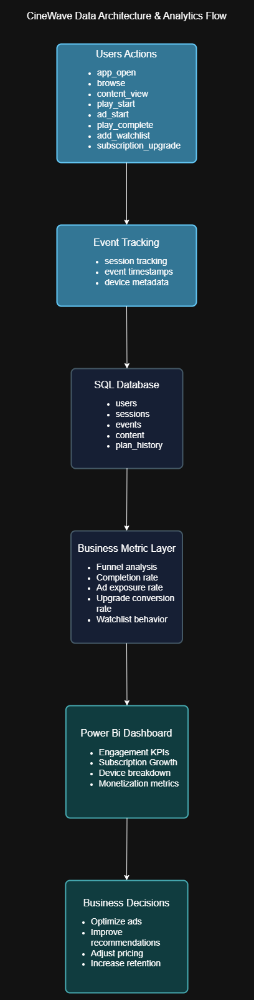
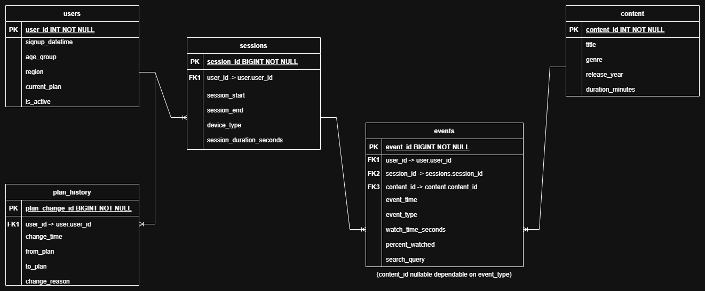
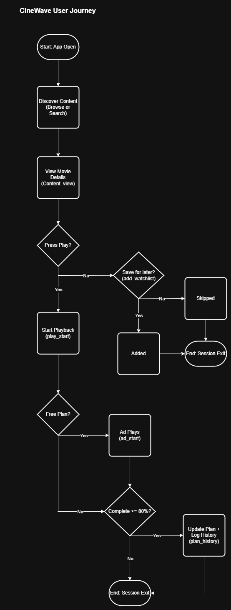
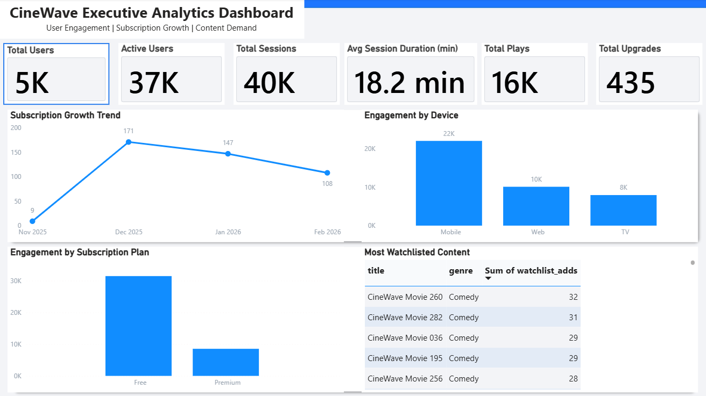

# cinewave-user-behavior-analytics
CineWave is a simulated streaming platform designed to analyze user behavior, engagement funnels, ad monetization, and subscription conversion using an event driven architecture.
This project demonstrates end to end product analysis thinking, from user interation tracking to SQL data modeling and business intelligence reporting.

---

## Business Objective
Streaming platforms rely on behvaior tracking to:
- Understand engagement funnels
- Measure completion rates
- Optimize ad exposure
- Increase premium subscription conversion
- Improve retention and recommendations

CineWave simulates real world analytics challenges.

---

## System Architecture
CineWave uses an event driven data model.
User actions generate event logs, which are stored in a relational SQL database and transformed into business metrics for dashboard reporting.

### Data Architecture

### Entity Relationship Diagram

### User Behavioral Funnel

---

## Data Schema
Core tables:
-'users` – User profile and subscription state
- 'sessions` – Session-level tracking
- 'events` – Behavioral event tracking
- 'content` – Movie catalog metadata
- 'plan_history` – Subscription lifecycle tracking

The system separates session context from event level tracking to enable granular behavioral analysis.

---

## Analytics Metrics Model
The project calculates:
- Funnel drop-off rates
- Completion rate (>=80%)
- Ad exposure rate (Free tier only)
- Upgrade conversion rate
- Watchlist intent behavior
- Device based engagement patterns

---

## Business Intelligence Layer
Data is visualized using Power BI to surface:
- Engagement KPIs
- Subscription growth
- Device breakdown
- Monetization metrics

---

## Subscription Lifecycle Modeling
Subscription upgrades are event driven.
'subscription_upgrade' events generate records in 'plan_history', demonstration how business state can be reconstructed from tracking logs (backfill logic included).|
This mirrors moden SaaS architecture patterns.

---

## Tech Stack
- SQL
- T-SQL
- Event Simulation Logic
- Power BI
- System Architecture Design
- Data Modeling

---

## What This Project Demonstrates
- Event driven system design
- Behavioral analytics modeling
- Monetization logic simulation
- Conversion funnel analysis
- Data architecture thinking
- Business aligned KPI development

---

## AI Assistance & Development Approach
This project was developed using AI assisted workflow.
AI tools were used as a collaborative support resource for:

- architectural brainstorming
- SQL pattern validation
- document refinement

All database decisions, analytics logic, system modeling, and final implementations weere reviewed, modified, and validated by Sahvaan Price.

## Author

Sahvaan Price Information Systems | Data Analysis | Business Systems Analysis
